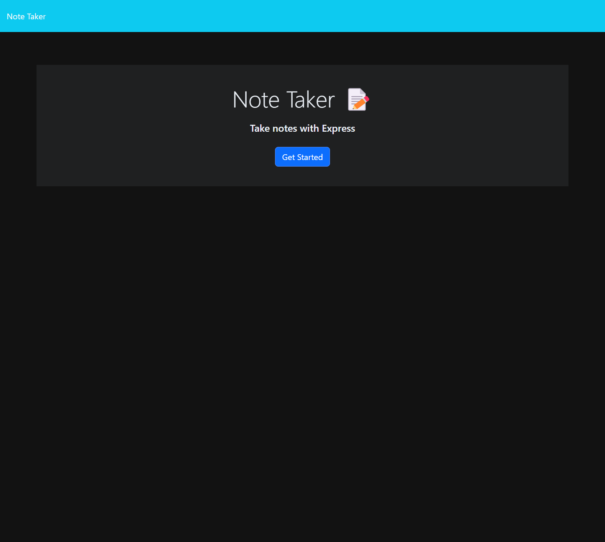
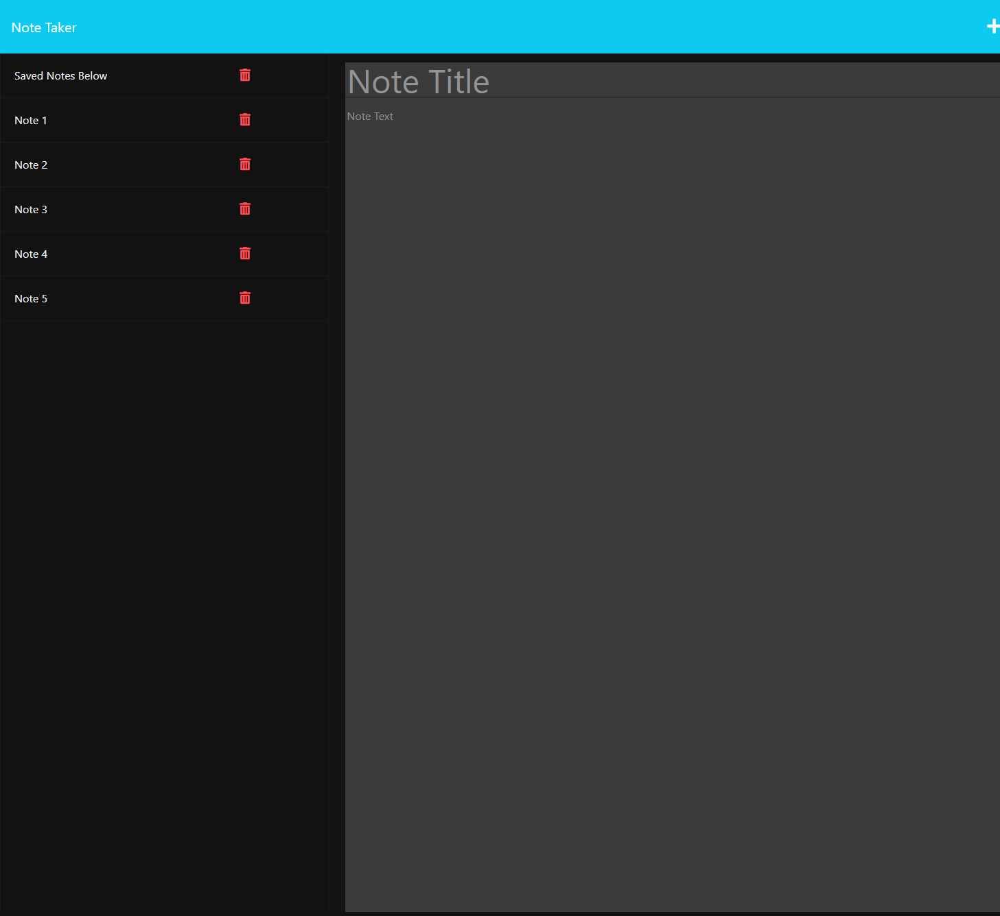

# Note-Taker

# Description / Goal

This "Note Taker" is designed to help you keep track of your notes by allowing you to create a title and description for your note to save and access later or delete to clean up your list.

# Installation

To install the application:  

* Visit https://github.com/sdfields/Note-Taker and clone the repository to your local computer.
* Install necessary packages by typing "npm install" into your command line with the repository open.

# Use

To use the application:  

* Press the blue "Get Started" button on the landing page
* Enter your "Note Title" and "Note Text"
* After you enter your note, press the save icon in the top right next to the + to save your note
* Your note will be saved on the left hand side
* You can access your note by clicking it or delete it by selecting the trashcan icon

# License

MIT License

# Links

Deployed Application: https://stark-shore-88669.herokuapp.com
GitHub: https://github.com/sdfields/Note-Taker

# Screenshots
Note Taker Home Page

Note Taker in Use
